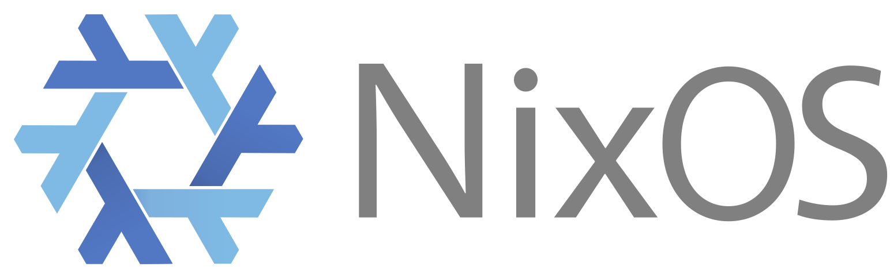

> This repository contains the the configuration files for the NixOS.

# NixOS



## What is NixOS?
NixOS is a Declarative linux distribution that allows reproducibility, and focuses of reliability.

### 1. Reproducible
Nix builds packages in isolation from each other. This ensures that they are reproducible and don’t have undeclared dependencies, so if a package works on one machine, it will also work on another.
Declarative

### 2. Declarative
Nix makes it trivial to share development and build environments for your projects, regardless of what programming languages and tools you’re using.
Reliable

### 3. Reliable
Nix ensures that installing or upgrading one package cannot break other packages. It allows you to roll back to previous versions, and ensures that no package is in an inconsistent state during an upgrade.

## Todo List
this is a todo-list of things we still need to do to get this system as I'd like. After all these are done, it will become a feature list!

- [x] modularity of the configurations:  
  - [x] create the 'module loader' that loads modules based on settings.  
  - [x] make it possible to load the config of a certain machine using the flake.  
- [ ] usability:
  - [x] Add "boot to windows" option when booting up.  
  - [ ] Fix keybindings using the config files so that every machine is immediately fixed.  
    - [x] Remap the linux modifiers to the Mac modifiers so the system behaves like a Mac.  
    - [x] Remap shortcuts Where`MAC SHORTCUT --> practical effect`:
      - [x] Navigation
        - [x] `CMD + RIGHT` $\rightarrow$ Go to the end of the line.
        - [x] `CMD + LEFT` $\rightarrow$ Go to the beginning of the line.
        - [x] `CMD + DOWN` $\rightarrow$ Go to the end of the file.
        - [x] `CMD + UP` $\rightarrow$ Go to the beginning of the file.
        - [x] `ALT + LEFT` $\rightarrow$ Go one word to the left.
        - [x] `ALT + RIGHT` $\rightarrow$ Go one word to the right
        - [x] `ALT + DOWN` $\rightarrow$ Go to the end of the current alinea.
        - [x] `ALT + UP` $\rightarrow$ Go to the beginning of current alinea.
      - [x] Selection
        - [x] `CMD + SHIFT + RIGHT` $\rightarrow$ Select from here to the end of the line.
        - [x] `CMD + SHIFT + LEFT` $\rightarrow$ Select from here to the beginning of the line.
        - [ ] `CMD + SHIFT + DOWN` $\rightarrow$ Select from here to the end of the file.
        - [x] `CMD + SHIFT + UP` $\rightarrow$ Select from here to the beginning of the file.
        - [x] `ALT + SHIFT + LEFT` $\rightarrow$ Select from here one word (more) to the left.
        - [x] `ALT + SHIFT + RIGHT` $\rightarrow$ Select from here one word (more) to the right
        - [x] `ALT + SHIFT + DOWN` $\rightarrow$ Select from here to the end of the current alinea.
        - [x] `ALT + SHIFT + UP` $\rightarrow$ Select from here to the beginning of current alinea.
      - [x] Deletion
        - [x] `CMD + BACK_SPACE` $\rightarrow$ Delete from here to the beginning of the line.
        - [x] `CMD + DELETE` $\rightarrow$ Delete from here to the end of the line
        - [x] `ALT + BACK_SPACE` $\rightarrow$ Delete from here one word to the left.
        - [x] `ALT + DELETE` $\rightarrow$ Delete from here one word to the right
  - [ ] configure the a window manager.  
  - [ ] configure the application launcher.
    - [ ] must launch applications.   
    - [ ] must take commands:   
      - [ ] sleep   
      - [ ] hibernate   
      - [ ] reboot   
      - [ ] shut down   
    - [ ] must be able to calculate.   
    - [ ] must be able to run terminal commands.   
  - [ ] install all apps that you want.  


## Learn NixOS
These resources helped me with building my own configuration file:

<table>
  <tr>
    <th>Name</th>
    <th>Link</th>
  </tr>
  <tr>
    <td>NixOS Setup Guide - Configuration / Home-Manager / Flakes</td>
    <td><a href="https://www.youtube.com/watch?v=AGVXJ-TIv3Y">YouTube</a></td>
  </tr>
  <tr>
    <td>How to Start Adding Modularity to Your NixOS Config</td>
    <td><a href="https://www.youtube.com/watch?v=bV3hfalcSKs">YouTube</a></td>
  </tr>
</table>

## Structure of this Repository
This repository has 3 main directories:
- **Systems**: *the systems that I've configured. Load modules from* [`modules/`](./modules/README.md) *. You can learn more about that module [here](./systems/README.md).*
- **Modules**: *is used to store a set of modules a [`system`](./systems/README.md) can load. You can learn more about that module [here](./modules/README.md).*
- **Users**: *this is were the home-manager data will be stored. You can read more about that module [here](./users/README.md).*

Here is an overview of the structure:

```
NixOS/
├── systems/
├── modules/
├── user/
├── flake.nix
└── flake.lock
```

There is also the [`flake.nix`](./flake.nix), and [`flake.lock`](./flake.lock) of course here at the root. The flow is as follows: 
- The flake takes the argument from the CLI and loads the *system* from [`./systems/`](./systems/README.md) somewhere.
- That *system* loads the *module* loader at [`/modules/default.nix`](./modules/default.nix), which you can read more about [here](./modules/README.md).
- The **module loader** loads the modules specified in the [**machines settings**](./systems/common-settings.nix).

You can learn more about the structure of the [systems directory](./systems/README.md#structure), [modules directory](./modules/README.md#structure), or [user directory](./systems/README.md#structure) by clicking these links.
